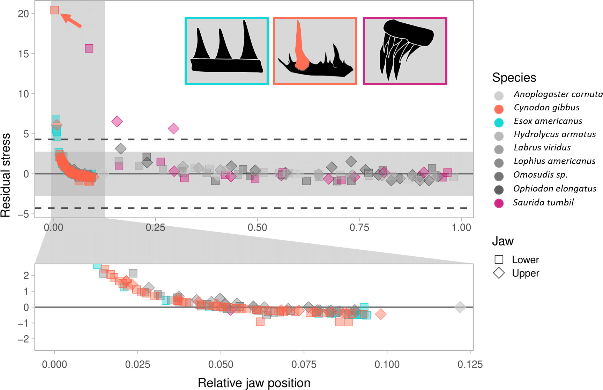

# Functional homodonty code

*Note: This branch is currently being adapted to allow tooth stress to be measured in 3D Slicer and analyzed in R*

This is the code required to run the functional homodonty analyses in [Cohen et al. 2020](https://doi.org/10.1111/joa.13248). The idea is to generate an empirical cutoff for functional homodonty. Rather than classifying dentitions as homodont (all teeth serve the same function) or heterodont (teeth serving different functions) on whether or not the teeth look sufficiently different, we can determine empircally which teeth are likely to serve different functions based on the degree to which the amount of stress they experience differs from the surrounding teeth. 

To run this code:

1. Download the repository.
2. Open the .Rproj file (you will have to [download RStudio](https://www.rstudio.com/) if you don't have it installed).
3. Open the RUNME.R file and run the example code!

To install FunctionalHomodonty for 3D Slicer

1. Download the repository.
2. Save the folder "Slicer-FunctionalHomodonty" on the Desktop or somewhere it can live for now.
3. Open 3D Slicer.
4. Navigate to the "Edit" button at the top, and click Application Settings
5. A pop-up window should appear -- navigate to the Modules tab.
6. Next to "additional module paths", drag and drop the "Slicer-FunctionalHomodonty" folder into the box with a list of modules.
7. Restart 3D Slicer.
8. The FunctionalHomodonty module should now be available to use under the Quanitification category or by searching for it.
